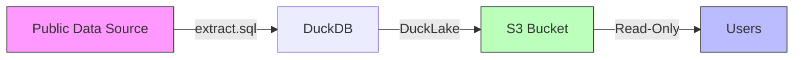
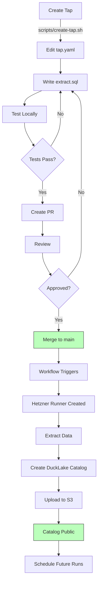
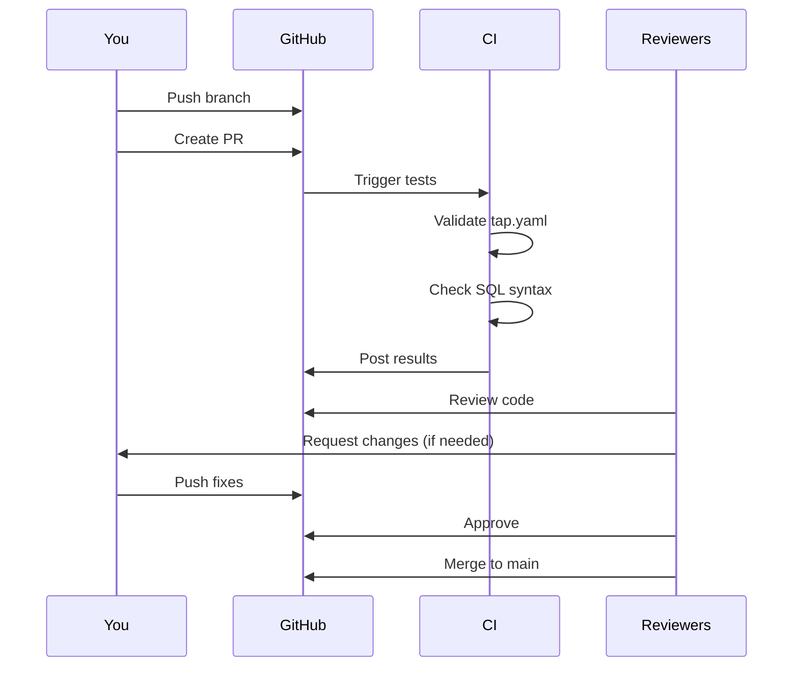
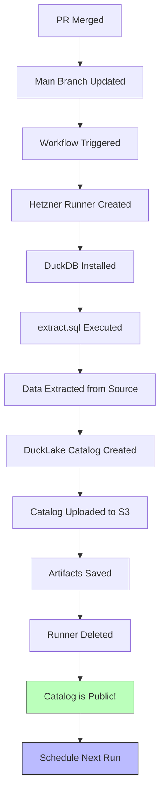
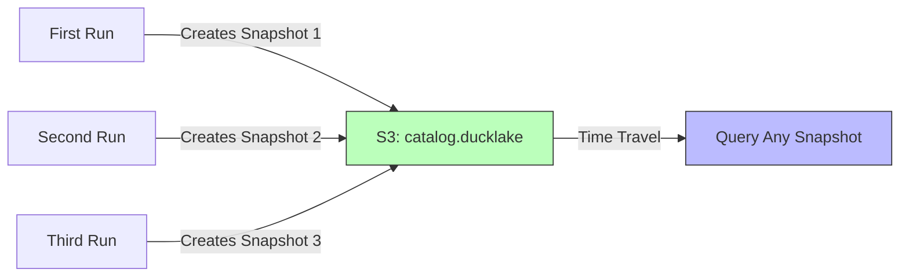
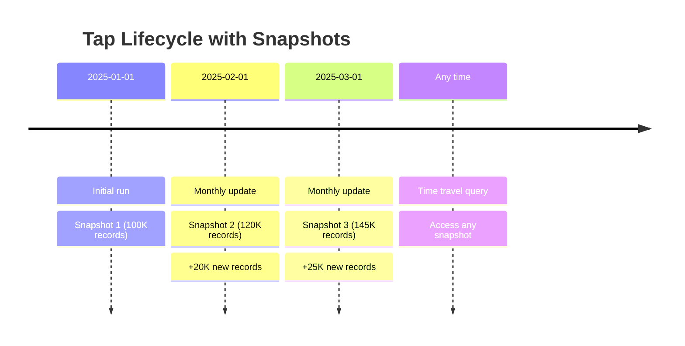

# Contributing to Walkthru Data

Welcome! This guide explains how to contribute new taps (datasets) to the Walkthru Data repository.

## Table of Contents

- [Overview](#overview)
- [Quick Start](#quick-start)
- [Tap Lifecycle](#tap-lifecycle)
- [Creating a New Tap](#creating-a-new-tap)
- [Tap Metadata (tap.yaml)](#tap-metadata-tapyaml)
- [Creating a Pull Request](#creating-a-pull-request)
- [After Your Tap is Merged](#after-your-tap-is-merged)
- [Data Updates & Versioning](#data-updates--versioning)
- [DuckLake Features](#ducklake-features)

---

## Overview

Walkthru Data is a **Homebrew-style registry** for open datasets. Each tap:
- Extracts data from a public source (API, satellite, survey, etc.)
- Stores it in an **isolated S3 directory**
- Uses **DuckLake** for versioning and snapshots
- Runs on **self-hosted Hetzner runners** (98% cheaper than GitHub)



---

## Quick Start

```bash
# 1. Create a new tap
./scripts/create-tap.sh re02 "My Real Estate Data"

# 2. Edit tap.yaml and extract.sql
cd taps/re02

# 3. Test locally
export AWS_ACCESS_KEY_ID="your-key"
export AWS_SECRET_ACCESS_KEY="your-secret"
duckdb -c ".read extract.sql"

# 4. Create PR
git add taps/re02/
git commit -m "Add re02: My Real Estate Data"
git push origin add-re02
gh pr create
```

---

## Tap Lifecycle



---

## Creating a New Tap

### Step 1: Choose a Tap ID

Format: `{category}{number}`

**Categories:**
- `re` - Real estate
- `cl` - Climate
- `dm` - Demographics
- `st` - Satellite
- `tr` - Transit
- `en` - Environment
- `if` - Infrastructure

**Examples:** `re01`, `cl01`, `dm01`, `st01`

### Step 2: Run the Tap Generator

```bash
./scripts/create-tap.sh <tap-id> "<tap-name>"
```

Example:
```bash
./scripts/create-tap.sh cl01 "Global Climate Data"
```

This creates:
```
taps/cl01/
├── tap.yaml       # Metadata and schedule
├── extract.sql    # DuckDB extraction script
└── README.md      # User documentation
```

### Step 3: Write Your Extraction Script

Your `extract.sql` should follow this pattern:

```sql
-- ============================================================================
-- Tap: cl01 (Global Climate Data)
-- Source: https://api.climate.gov/data
-- Output: s3://walkthru-earth/cl01/
-- ============================================================================

-- Install extensions
INSTALL httpfs; LOAD httpfs;
INSTALL http_client FROM community; LOAD http_client;
INSTALL json; LOAD json;

-- ============================================================================
-- S3 Configuration
-- ============================================================================

CREATE OR REPLACE SECRET s3_secret (
    TYPE S3,
    PROVIDER credential_chain,
    ENDPOINT 'fsn1.your-objectstorage.com',
    URL_STYLE 'vhost',
    USE_SSL true,
    REGION 'us-east-1'
);

-- ============================================================================
-- Extract Data from Source
-- ============================================================================

CREATE OR REPLACE TABLE climate_data AS
SELECT * FROM read_json_auto('https://api.climate.gov/data/latest');

-- Transform to typed schema
CREATE OR REPLACE TABLE climate_final AS
SELECT
    CURRENT_TIMESTAMP AS extracted_at,
    column1::INT AS id,
    column2::DOUBLE AS temperature,
    column3::VARCHAR AS location
FROM climate_data;

-- ============================================================================
-- DuckLake Setup (Simple & Isolated)
-- ============================================================================

INSTALL ducklake;
LOAD ducklake;

-- Attach DuckLake catalog
ATTACH 'ducklake:sqlite:data/cl01.ducklake' AS cl01_lake (
    DATA_PATH 's3://walkthru-earth/cl01/'
);

-- Create table (automatically versioned)
CREATE OR REPLACE TABLE cl01_lake.climate AS
SELECT * FROM climate_final;

-- Detach to flush writes
DETACH cl01_lake;

-- ============================================================================
-- Summary
-- ============================================================================

ATTACH 'ducklake:sqlite:data/cl01.ducklake' AS cl01_lake (READ_ONLY);

SELECT
    'Export Complete' AS status,
    'cl01' AS dataset_id,
    's3://walkthru-earth/cl01/' AS s3_location,
    (SELECT COUNT(*) FROM cl01_lake.climate) AS total_records,
    CURRENT_TIMESTAMP AS extracted_at
FROM (SELECT 1) AS dummy;
```

---

## Tap Metadata (tap.yaml)

The `tap.yaml` file is the **most important** part of your tap. It defines metadata for **discovery and scheduling** - S3 paths are handled automatically!

### Full Example

```yaml
# Tap ID (must match directory name)
id: cl01

# Display name
name: "Global Climate Data"

# Short description (1-2 sentences)
description: "Daily climate measurements from weather stations worldwide, including temperature, precipitation, and wind data."

# Category (determines tap ID prefix)
category: climate

# Keywords for search/discovery (5-10 recommended)
# IMPORTANT: These are used for `walkthru search`
keywords:
  - climate
  - weather
  - temperature
  - precipitation
  - meteorology
  - NOAA
  - global
  - time-series

# Data source information
source:
  name: "NOAA Climate Data API"
  url: "https://www.ncdc.noaa.gov/cdo-web/api/v2"
  license: "Public Domain"
  attribution: "National Oceanic and Atmospheric Administration"

# Update schedule (cron format)
schedule:
  cron: "0 2 * * *"  # Daily at 2 AM UTC
  timezone: "UTC"

# Geographic coverage
geography:
  - global
  # or specific: [USA, Europe, Egypt]

# Time coverage
temporal:
  start: "2020-01-01"
  end: "present"
  granularity: "daily"  # daily, weekly, monthly, yearly

# Expected record count (approximate)
records: ~500000

# Hetzner runner configuration
runner:
  type: "cax11"        # ARM64, 2 vCPU, 4 GB RAM
  location: "nbg1"     # Nuremberg datacenter
  timeout: 30          # Minutes

# Maintainer information
maintainers:
  - name: "Your Name"
    github: "yourusername"
    email: "you@example.com"

# Output schema (for documentation)
schema:
  - name: "extracted_at"
    type: "TIMESTAMP"
    description: "When this data was extracted"
  - name: "station_id"
    type: "VARCHAR"
    description: "Weather station identifier"
  - name: "date"
    type: "DATE"
    description: "Measurement date"
  - name: "temperature_c"
    type: "DOUBLE"
    description: "Temperature in Celsius"
  - name: "precipitation_mm"
    type: "DOUBLE"
    description: "Precipitation in millimeters"
```

### Important Fields Explained

**Keywords** (most important for discovery):
- Used for search: `walkthru search "temperature"`
- 5-10 keywords recommended
- Include: topic, source name, data type, geography

**Category**:
- Determines tap ID prefix (`cl01`, `dm01`, etc.)
- Used for filtering: `walkthru list --category climate`

**Schedule**:
- How often the tap runs automatically
- Common patterns:
  - `"0 2 * * *"` - Daily at 2 AM
  - `"0 2 * * 0"` - Weekly on Sunday
  - `"0 2 1 * *"` - Monthly on 1st
  - `"0 2 1 1,4,7,10 *"` - Quarterly

**Geography**:
- Used for filtering by region
- Can be `global` or specific countries/regions

**Runner**:
- `cax11` - ARM64, 2 vCPU, 4 GB RAM (default)
- `cax21` - ARM64, 4 vCPU, 8 GB RAM (larger datasets)
- `cax31` - ARM64, 8 vCPU, 16 GB RAM (very large)

**Note:** S3 paths are **automatically** set to `s3://walkthru-earth/{tap-id}/` - you don't need to configure them!

---

## Creating a Pull Request



### Step 1: Create a Branch

```bash
git checkout -b add-cl01
```

### Step 2: Test Your Tap Locally

```bash
# Set credentials
export AWS_ACCESS_KEY_ID="your-key"
export AWS_SECRET_ACCESS_KEY="your-secret"

# Create data directory
mkdir -p data

# Run extraction
duckdb -c ".read taps/cl01/extract.sql"

# Verify catalog was created
ls -lh data/cl01.ducklake

# Query the catalog
duckdb -c "
  ATTACH 'ducklake:sqlite:data/cl01.ducklake' AS lake (READ_ONLY);
  SELECT COUNT(*) FROM lake.climate;
"
```

### Step 3: Commit and Push

```bash
git add taps/cl01/
git commit -m "Add cl01: Global Climate Data"
git push origin add-cl01
```

### Step 4: Create Pull Request

```bash
gh pr create --title "Add cl01: Global Climate Data" --body "
## Summary
Adds global climate data from NOAA API.

## Data Source
- **Source**: NOAA Climate Data API
- **License**: Public Domain
- **Records**: ~500,000
- **Update**: Daily

## Testing
- [x] Tested extraction locally
- [x] Verified DuckLake catalog creation
- [x] Confirmed S3 upload works
- [x] Validated schema
"
```

---

## After Your Tap is Merged



### What Happens Automatically

1. **GitHub Actions Workflow Starts**
   - Triggered by merge to `main`
   - Reads your `tap.yaml` for configuration

2. **Hetzner Runner Created**
   - Creates a temporary cloud server
   - Type and location from your `tap.yaml`
   - ~90 seconds to provision

3. **Extraction Runs**
   - Installs DuckDB
   - Sets up AWS credentials
   - Executes your `extract.sql`
   - Creates DuckLake catalog

4. **Catalog Uploaded to S3**
   - Uploads `catalog.ducklake` to S3
   - Path: `s3://walkthru-earth/{tap-id}/catalog.ducklake`

5. **Runner Deleted**
   - Temporary server destroyed
   - Catalog remains in S3

6. **Scheduled for Future Runs**
   - Added to scheduler
   - Runs according to your cron schedule

### Your Data is Now Public!

Anyone can query your tap:

```sql
-- Configure S3 access
CREATE OR REPLACE SECRET s3_secret (
    TYPE S3,
    PROVIDER credential_chain,
    ENDPOINT 'fsn1.your-objectstorage.com',
    URL_STYLE 'vhost',
    USE_SSL true,
    REGION 'us-east-1'
);

-- Attach your tap's catalog
ATTACH 'ducklake:sqlite:s3://walkthru-earth/cl01/catalog.ducklake' AS cl01 (READ_ONLY);

-- Query the data
SELECT * FROM cl01.climate LIMIT 10;
```

---

## Data Updates & Versioning



### How DuckLake Handles Updates

When your tap runs again (based on schedule):

1. **DuckLake Attaches Existing Catalog**
   ```sql
   ATTACH 'ducklake:sqlite:data/cl01.ducklake' AS cl01_lake (
       DATA_PATH 's3://walkthru-earth/cl01/'
   );
   ```

2. **You Choose Update Strategy**

   **Option A: Replace All Data (Full Refresh)**
   ```sql
   -- Overwrites entire table
   CREATE OR REPLACE TABLE cl01_lake.climate AS
   SELECT * FROM climate_final;
   ```

   **Option B: Append New Data Only (Incremental)**
   ```sql
   -- Insert only new records
   INSERT INTO cl01_lake.climate
   SELECT * FROM climate_final
   WHERE date > (SELECT MAX(date) FROM cl01_lake.climate);
   ```

   **Option C: Upsert (Update + Insert)**
   ```sql
   -- Delete changed records
   DELETE FROM cl01_lake.climate
   WHERE station_id IN (SELECT station_id FROM climate_final);

   -- Insert updated records
   INSERT INTO cl01_lake.climate
   SELECT * FROM climate_final;
   ```

3. **DuckLake Creates Snapshot Automatically**
   - Every operation creates a new snapshot
   - Snapshots are lightweight (just metadata)
   - No data duplication

### Understanding Snapshots



### Querying Snapshots

```sql
-- Attach catalog
ATTACH 'ducklake:sqlite:data/cl01.ducklake' AS lake (READ_ONLY);

-- View all snapshots
SELECT * FROM ducklake_snapshots();

-- Output:
-- snapshot_id | created_at           | parent_snapshot_id
-- 1           | 2025-01-01 02:00:00  | NULL
-- 2           | 2025-02-01 02:00:00  | 1
-- 3           | 2025-03-01 02:00:00  | 2

-- Query specific snapshot
SELECT * FROM lake.climate AT 1;  -- January data
SELECT * FROM lake.climate AT 2;  -- February data
SELECT * FROM lake.climate;       -- Latest (March)

-- See what changed between snapshots
SELECT * FROM ducklake_table_changes('climate', 1, 2);
```

---

## DuckLake Features

### 1. ACID Transactions

Every operation is atomic:
```sql
-- This either fully succeeds or fully fails
BEGIN TRANSACTION;
  DELETE FROM lake.climate WHERE year = 2024;
  INSERT INTO lake.climate SELECT * FROM new_data_2024;
COMMIT;
```

### 2. Time Travel

Query data as it existed at any point:
```sql
-- Query by snapshot ID
SELECT COUNT(*) FROM lake.climate AT 5;

-- Query by timestamp
SELECT * FROM lake.climate AT TIMESTAMP '2025-01-15 10:00:00';
```

### 3. Rollback

Undo mistakes:
```sql
-- Oops, deleted wrong data!
DELETE FROM lake.climate WHERE country = 'USA';

-- Rollback to previous snapshot
CALL ducklake_rollback('climate', 10);
```

### 4. Change Tracking

See exactly what changed:
```sql
-- Get all changes between snapshots
SELECT
    operation,  -- 'INSERT', 'DELETE', 'UPDATE'
    COUNT(*) as count
FROM ducklake_table_changes('climate', 5, 10)
GROUP BY operation;
```

### 5. Statistics & Performance

DuckLake maintains column statistics automatically:
```sql
-- Filter pushdown works efficiently
SELECT * FROM lake.climate
WHERE temperature_c > 30  -- Uses statistics
  AND date BETWEEN '2024-01-01' AND '2024-12-31';
```

---

## Best Practices

### 1. Incremental Updates

For large datasets, use incremental updates:

```sql
-- Store last extraction time
CREATE OR REPLACE TABLE _config AS
SELECT
    'cl01' AS tap_id,
    CURRENT_TIMESTAMP AS extracted_at,
    COALESCE(
        (SELECT MAX(date) FROM cl01_lake.climate),
        DATE '2020-01-01'
    ) AS last_date;

-- Extract only new data
CREATE OR REPLACE TABLE climate_new AS
SELECT *
FROM read_json_auto('https://api.climate.gov/data')
WHERE date > (SELECT last_date FROM _config);

-- Append to DuckLake
INSERT INTO cl01_lake.climate
SELECT * FROM climate_new;
```

### 2. Deduplication

Always deduplicate your data:

```sql
CREATE OR REPLACE TABLE climate_final AS
SELECT DISTINCT * FROM climate_raw;

-- Or with specific keys
CREATE OR REPLACE TABLE climate_final AS
SELECT * FROM (
    SELECT
        *,
        ROW_NUMBER() OVER (
            PARTITION BY station_id, date
            ORDER BY extracted_at DESC
        ) as rn
    FROM climate_raw
) WHERE rn = 1;
```

### 3. Error Handling

Make your extraction robust:

```sql
-- Use TRY_CAST for unsafe conversions
SELECT
    TRY_CAST(temperature AS DOUBLE) AS temperature_c,
    COALESCE(station_name, 'Unknown') AS station_name
FROM raw_data;

-- Handle API failures
CREATE OR REPLACE TABLE api_response AS
SELECT * FROM read_json_auto('https://api.example.com/data')
WHERE status_code = 200;  -- Only process successful responses
```

---

## Getting Help

- **Issues**: [GitHub Issues](https://github.com/walkthru-earth/walkthru-data/issues)
- **Discussions**: [GitHub Discussions](https://github.com/walkthru-earth/walkthru-data/discussions)
- **DuckDB Docs**: [duckdb.org](https://duckdb.org)
- **DuckLake Docs**: [ducklake.select](https://ducklake.select)

---

## License

Taps are MIT licensed. Data is subject to original sources' terms.
